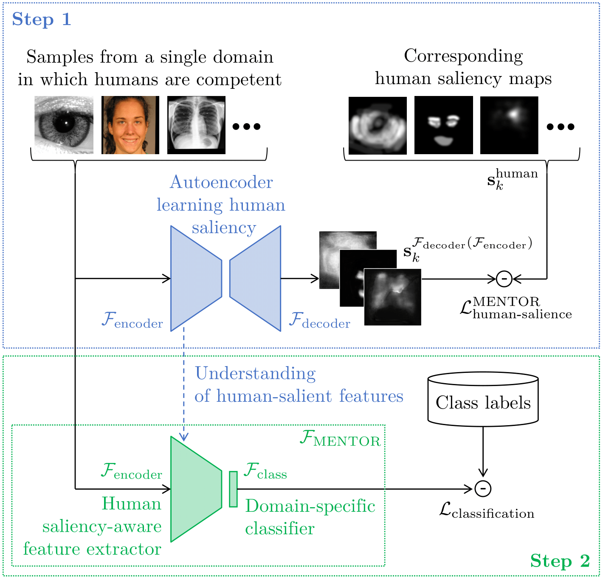
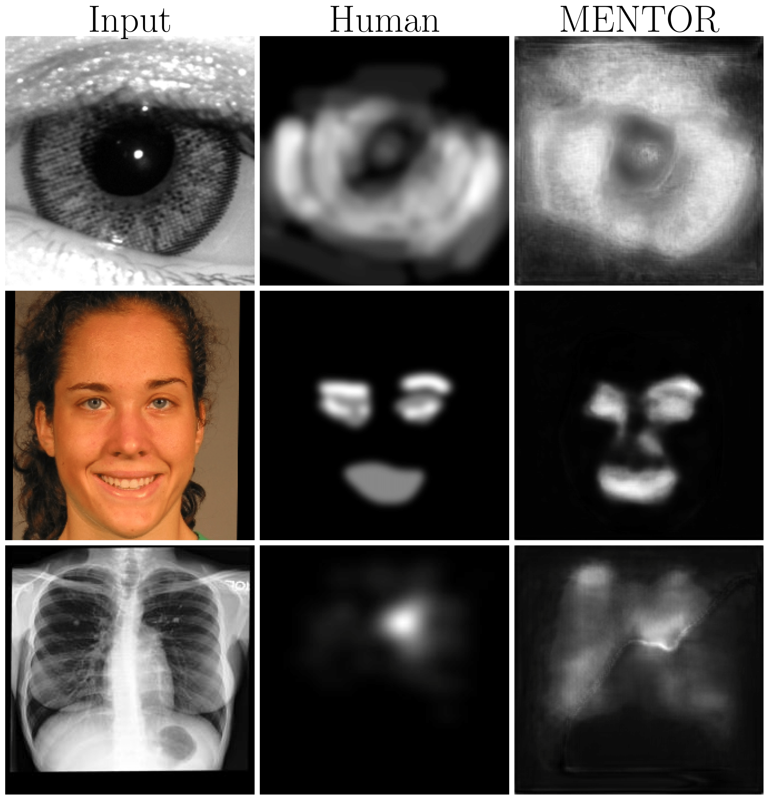

# MENTOR: Human Perception-Guided Pretraining for Increased Generalization

Official repository for the IEEE/CVF Winter Conference on Applications of Computer Vision (WACV 2025) paper.

### Paper: IEEEXplore | [ArXiv](https://arxiv.org/abs/2310.19545v2)

# Overview of Method

<p align="center">
  
</p>

### Abstract
> Leveraging human perception into training of convolutional neural networks (CNN) has boosted generalization capabilities of such models in open-set recognition tasks. One of the active research questions is where (in the model architecture or training pipeline) and how to efficiently incorporate always-limited human perceptual data into training strategies of models. In this paper, we introduce MENTOR (huMan pErceptioN-guided preTraining fOr increased geneRalization), which addresses this question through two unique rounds of training CNNs tasked with open-set anomaly detection. First, we train an autoencoder to learn human saliency maps given an input image, without any class labels. The autoencoder is thus tasked with discovering domain-specific salient features which mimic human perception. Second, we remove the decoder part, add a classification layer on top of the encoder, and train this new model conventionally, now using class labels. We show that MENTOR successfully raises the generalization performance across three different CNN backbones in a variety of anomaly detection tasks (demonstrated for detection of unknown iris presentation attacks, synthetically-generated faces, and anomalies in chest X-ray images) compared to traditional pretraining methods (e.g., sourcing the weights from ImageNet), and as well as state-of-the-art methods that incorporate human perception guidance into training. In addition, we demonstrate that MENTOR can be flexibly applied to existing human perception-guided methods and subsequently increasing their generalization with no architectural modifications.

<p align="center">
  
</p>

# How to run

1. Build the conda environment for the autoencoder using `autoencoder-environment.yml`, and `environment.yml` for the subsequent CNNs.
2. Train MENTOR using the instructions provided in `MENTOR training.ipynb`
3. Train and test CNNs (ResNet152, InceptionV4, and EfficientNet_b7) using MENTOR and ImageNet weights using `./training_code/train.py` and `./testing_code/test.py`

**MENTOR weights** for all architectures can be downloaded via this [Box folder](https://notredame.box.com/s/xzpshhh0l07qgfledevhf8ttgn1kscat).

# Citation
```
@inproceedings{crum2025mentor,
  title={MENTOR: Human Perception-Guided Pretraining for Increased Generalization},
  author={Crum, Colton R and Czajka, Adam},
  booktitle={IEEE/CVF Winter Conference on Applications of Computer Vision (WACW)}, 
  year={2025},
  pages={1--8}
}
```
